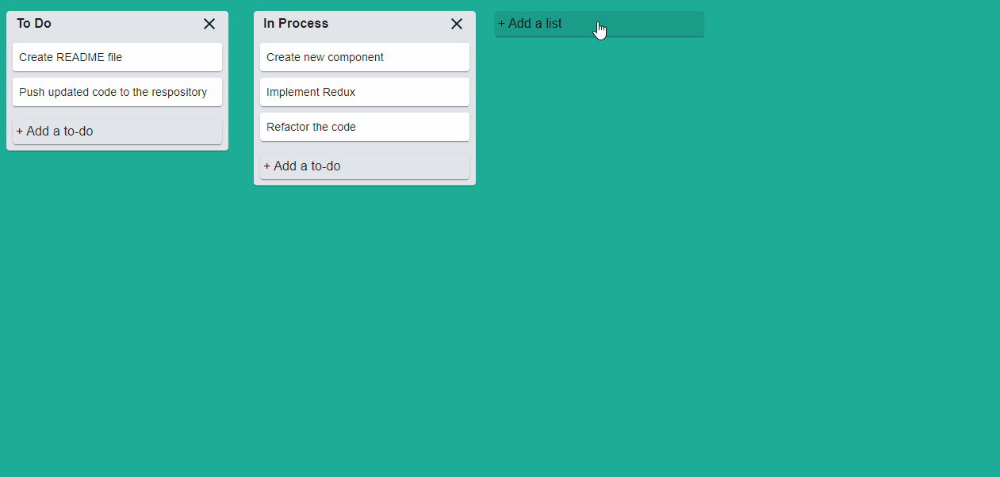

# Task Manager - Trello Clone

React trello clone app that helps users to manage their tasks.

## Description

A user can create a new list, and new to-dos, as well as modify list's title and to-dos, delete lists and todos.

## Technologies

* ReactJS
* Redux 
* Material UI

## Problems that I faced during the devolpment

It was the first time I was implementing on my own Redux into a React project, so it was really challenging.
The most difficult part was the creation of reducers, especially for to-dos' edition and deletion.